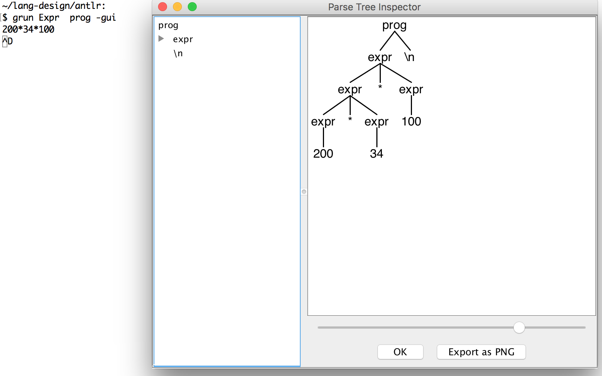

### AST (Abstract Syntax Tree)

[Ref](https://en.wikipedia.org/wiki/Abstract_syntax_tree)

[Ref](https://ruslanspivak.com/lsbasi-part7/)

AST is tree representation of the abstract syntactic structure of source code written in a programming language.

Each node of the tree denotes a construct occurring in the source code. 


#### Parse Tree

Grammar:

```
grammar Expr;       
prog:   (expr NEWLINE)* ;
expr:   expr ('*'|'/') expr
    |   expr ('+'|'-') expr
    |   INT
    |   '(' expr ')'
    ;
NEWLINE : [\r\n]+ ;
INT     : [0-9]+ ;

```



Here are the main differences between ASTs and Parse Trees:

- ASTs uses operators/operations as root and interior nodes and it uses operands as their children.
    
- ASTs do not use interior nodes to represent a grammar rule, unlike the parse tree does.
    
- ASTs don’t represent every detail from the real syntax (that’s why they’re called abstract) - no rule nodes and no parentheses, for example.
    
- ASTs are dense compared to a parse tree for the same language construct.


 


-----


------


----


----


---

7 + 3 * (10 / (12 / (3 + 1) - 1))


