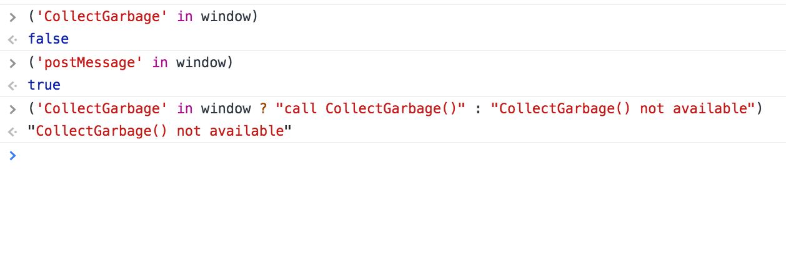
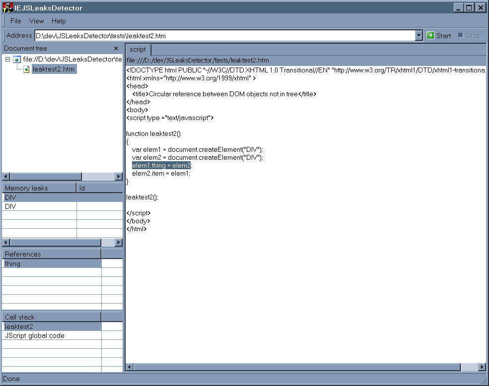

#### What is memory leak?

Memory that is not required by an application anymore that for some reason is not returned to the operating system or the pool of free memory


Background:

JScript and VBScript both are automatic storage languages. Unlike, say, C++, the script developer does not have to worry about explicitly allocating and freeing each chunk of memory used by the program. The internal device in the engine which takes care of this task for the developer is called the garbage collector. This is very similar to Java Garbage Collection (GC):


Java GC is explained [here](java-GC.md)


JScript uses a nongenerational mark-and-sweep garbage collector. It works like this:

Scav list:

Every variable which is "in scope" is called a "scavenger".

 A scavenger may refer to a number, an object, a string, whatever. JScript engine maintains a list of scavengers -- variables are moved on to the scav list when they come into scope and off the scav list when they go out of scope.


Every now and then the garbage collector(GC) runs.

 First it puts a "mark" on every object, variable, string, etc – all the memory tracked by the GC. 

JScript uses the VARIANT data structure internally and there are plenty of extra unused bits in that structure, so we just set one of them.

Engine clears the mark on the scavengers and the transitive closure of scavenger references. So if a scavenger object references a nonscavenger object then we clear the bits on the nonscavenger, and on everything that it refers to.

At this point we know that all the memory still marked is allocated memory which cannot be reached by any path from any in-scope variable. All of those objects are instructed to tear themselves down, which destroys any circular references.


Manually forcing GC:


You can force the JScript garbage collector to run with the ```CollectGarbage()``` method,

Doc for this JScript method: [CollectGarbage](https://msdn.microsoft.com/en-us/library/microsoft.jscript.globalobject.collectgarbage(VS.80).aspx)
How check the avaiabilty of undocumented CollectGarbage():



Leaks:


When here is a reference of any kind created (such as an event handler) between the two engines, and let us say one of your Javascript function scope exits, there may still be a reference to a symbol within that function that is referenced in the DOM (e.g. via an event handler such as onload). This in turn confuses JScript garbage collector, which in turn causes for it not to clean up, which then in turn causes the memory leak. 


How to Help GC:
 We can help the garbage collector in JScript by marking the symbols with a **null** value that you want to be garbage collected.


Example to write leak free code:

```

 function createPerson(firstName, lastName) {
   var date = new Date(), counter = 0, registry = {}, output;

   // function code work here

   // cleanup time
   // locals cleanup after we produced output
   // The strategy is to dispose of as many symbols as possible

   date = counter = registry = null;

   // the return statement cleans up whatever symbol it returns 
   return output;
  }


```


### DOM references 

This is case of we are  crossing from one engine into the other:

```

function getElements(id) {
   // DOM method: getElementById(...). We are crossing engines

   var element = document.getElementById(id);
   var  i ;  
   // get all the div tags of tagLength in size 
   var  tags = document.getElementsByTagName("div"); 
   var tagsLength = tags.length;

   //  clear all references that you hold to a DOM element
   //  this is the main source for the memory leaks
   for (i = 0; i < tagsLength; i++) {
     // code goes here
     
     // help GC 
     tags[i] = null;
    }

   // help GC: clean up other locals
   element = i = tags = null;
}

``` 

How about Event Handlers:

Event handler is a link between the DOM engine and the JavaScript engine since the element references a JavaScript function

Solution:

maintain a registry of all event handlers (say: eventRegistry) that you've attached so that you can eventually detach them in window.unload()


```
//Pay particular attention to event subscription and DOM references, 
// and ensuring that each component has a working teardown operation that releases all DOM references. 

window.unload = function () {
  // clean up event by setting event registry items to null 

  // self
  window.unload = null;

   // force GC -  IE-specific function
   // it does not guarantee that it will be done on demand.
   //  we are merely asking for it to be done sooner than later.
   // check this method is not undefined
   if (window.CollectGarbage() !== undefined){
       window.CollectGarbage();
   }

 }


```

### Observations Single Page Applications (SPA):

An IE process functions normally until about 1.6GB RAM.

Somewhere between 1.6GB and 1.8GB the browser will recycle the process, which is almost transparent to the user, dropping RAM back down to 200MB.

The process can only be transparently recycled when the user navigates from one page to another or reloads the page (which may never happen in an SPA).

If the web app causes IE to consume RAM in a single operation so that it starts at < 1.6GB and completes at > 1.8GB the process will terminate without warning.

#### About IE 6 and 7 

Internet Explorer 6 and 7 are known to have reference-counting garbage collectors for DOM objects. Cycles are a common mistake that can generate memory leaks
The following circular reference code will result in memory leak:

```javascript

var div;
window.onload = function() {
  div = document.getElementById('myDivElement');
  // main issue is in the next line...
  div.circularReference = div;
  div.lotsOfData = new Array(10000).join('*');
};

```

DOM element "myDivElement" has a circular reference to itself in the "circularReference" property. If the property is not explicitly removed or nulled, a reference-counting garbage collector will always have at least one reference intact and will keep the DOM element in memory even if it was removed from the DOM tree. If the DOM element holds lots of data (illustrated in the above example with the "lotsOfData" property), the memory consumed by this data will never be released.


#### Tools

[IE JS Leaks Detector](img/IEJSLeaksDetector2.0.1.1.zip)

This JavaScript Memory Leak Detector is a debugging tool to detect memory leaks and enforce best practices in JavaScript code when working with version of Internet Explorer older than IE8.

IEJSLeaksDetector is a plain, native, Windows application and does not require any particular setup (the executable can be just unzipped and run).
It only runs in 32 bit versions of Windows. 64 bits editions are not supported yet.




How to use the tool

The user can start the memory profiling of a web application navigating to the desired URL. A new tab is opened with a WebBrowser control and a tree view shows all the documents and scripts that compose the current page.
When the user has finished to interact with the page he can click the "Stop" button, which causes the tool to close the control and track possible leaks. 
Memory leaks are listed specifying the DOM object's type and a list of "attached" JavaScript objects whose circular reference could be the cause of the leak. The tool also shows the call stack correponding to a memory leak, which represents the state of the script at the moment when the JavaScript object was attached to the DOM object. Finally, a script window highlights the exact point in the JavaScript code where the memory leak originated.


[More Details](https://blogs.msdn.microsoft.com/gpde/2009/08/03/javascript-memory-leak-detector-v2/)


#### Useful links


[How Do The Script Garbage Collectors Work?](https://blogs.msdn.microsoft.com/ericlippert/2003/09/17/how-do-the-script-garbage-collectors-work/)

[JavaScript Memory Leaks in Internet Explorer](http://milan.adamovsky.com/2012/02/javascript-memory-leaks-in-internet.html) 

[Understanding and Solving Internet Explorer Leak Patterns](https://msdn.microsoft.com/en-us/library/bb250448.aspx)

[How to Work Around IE Memory Leaks in SPAs](https://medium.com/@garthw/how-to-work-around-ie-memory-leaks-in-spas-b2f6bc7c9ae9)


[IE Memory leak in emberjs](https://github.com/emberjs/ember.js/issues/13940)

[MS Virtual machines](https://developer.microsoft.com/en-us/microsoft-edge/tools/vms/)

[GC for game developers](https://www.scirra.com/blog/76/how-to-write-low-garbage-real-time-javascript)

[Memory Management in Javascript](https://developer.mozilla.org/en-US/docs/Web/JavaScript/Memory_Management)

[4 Types of Memory Leaks in JavaScript and How to Get Rid Of Them](https://auth0.com/blog/four-types-of-leaks-in-your-javascript-code-and-how-to-get-rid-of-them/)
 


