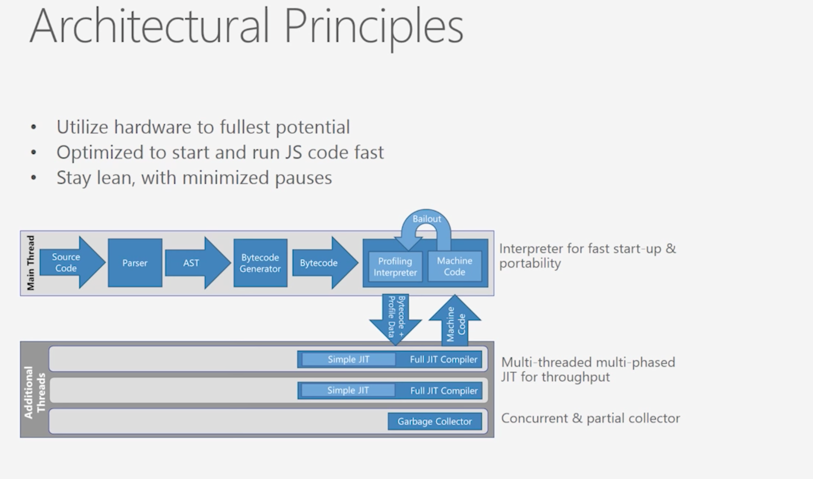
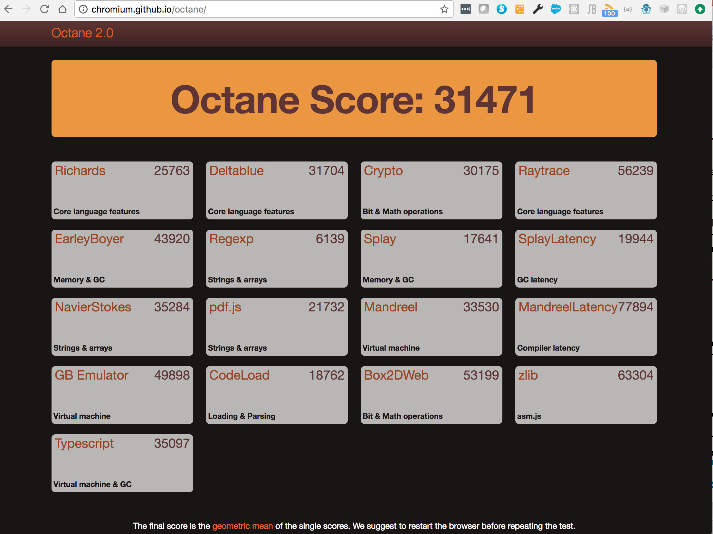
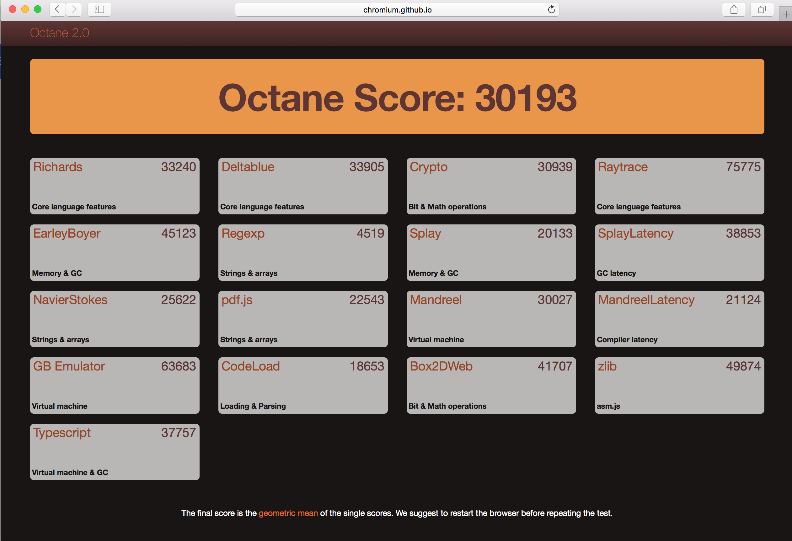

## Notes on IE JavaScript Engine: Chakra


#### Components


#### Architecture



[Ref](https://github.com/Microsoft/ChakraCore/wiki/Architecture-Overview)


#### Video
[](https://www.youtube.com/watch?v=1bfDB3YPHFI)


###Chakra Core


Chakra Core has certain components of **Chakra** and is modified to report certain data differently.

 Instead of **COM-based** diagnostic APIs, Chakra Core provides **JSON-based diagnostic APIs** which allow more applications with JSON parsers to support Chakra Core.
 
 
 **JS to AST to bytecode**:

Chakra Core first reads through the Javascript code syntax and parses it to generate its AST. 

After the AST is generated, the code is passed to the **bytecode generator** and then the bytecode gets **profiled**. 

This is different from Chrome V8 engine, which has a decision process that decides whether a piece of code should be profiled and optimized or should be turned into bytecode.


During the profiling process, the interpreter attempts to send the code to parallel JIT compilers.

 There are two types of JIT compilers available: 
 
 1. simple JIT compiler (quick compilation without much optimization)
 2. full JIT compiler (takes more time but produces better machine code, in case of code out of it's profile, bailout to simple JIT compiler happens)


**Garbage Collection**

As for garbage collection, it is done in a generational **mark-and-sweep** manner. 

When garbage collection happens, a **foreground and background thread** will be spawned to carry out different executions.

The background garbage collector will do a mark, rescan and mark to find objects that should be cleaned up.


### How to use the Memory tool to diagnose memory issues that can impact the speed and stability of webpages

[Ref](https://docs.microsoft.com/en-us/microsoft-edge/f12-devtools-guide/memory)


#### Use case:

The webpage is performing well when it **first loads**, but gradually slows and sometimes crashes, the page's memory use might be the problem.

How to Diagnosing this memory issue?

After you've loaded your webpage in the browser, open the **F12** developer tools and open the Memory tool (CTRL + 6).

 You can start profiling from this screen and take heap snapshots during the profiling session.
 
If the problem is high memory usage from the start, but not memory growth, take one snapshot and examine it to find the bigger areas of memory use. 

If the memory use grows over time, you can compare snapshots to look at the areas where memory is growing.


Note:

Total memory timeline shows the memory use by the **current browser tab's processes** as a graph over time.


Each snapshot shows a thumbnail of the webpage as it appeared at the **time** the snapshot was taken and specifics about the memory usage of your code.

Object Counts:

The number of new objects created and old objects removed are shown below the object count.

 If these numbers are high, you might have a **performance problem**. When the amount of memory you use isn't bad, but a lot of objects are being created and removed, you create work for the **garbage collector** process which frees up memory. 
 
**Garbase collector and performance impacts:**
 
 Garbage collecting uses (CPU) processing power, however, so it's best to find ways to reuse or recycle these objects and give the garbage collector a break.
 

**Signs for Memory Leak**

Another important factor to keep in mind is the difference between the number of objects being added and objects being removed.

 This is displayed in your second snapshot and beyond in the upper right in a "+x/-y" format.  Example: **+96/-9**
 
In the set of snapshots above, it shows that each time we ran the process we suspected of having a memory issue, we increased the number of objects by **96**, but only removed **9**. 

This is a strong clue that there's a **memory leak** in the process.

Memory leaks will keep expanding the memory use of your webpage during a user's session with it, causing slowness or even instability if the memory use grows too big.


#### Snapshot detailed view


Note:

 If you see: **the DOM node is not attached to the DOM** : this can happen when the node has been removed from the DOM, but is referred to elsewhere.
 
 
 Circular references: 
 
 In its simplest form, a circular reference happens when one object refers to another object that refers back to it, creating a loop.
 

**3 View types**

The three view types

Types:

 view groups objects by their constructor function and gives a count of each type. This makes it easier to know how many arrays you have, how many strings, and so on. Those groups can be expanded to view individual objects.

Roots:

 view shows the major root objects that you can expand to see the child objects associated with them.

Dominators:

 view breaks out all individual HTML elements, DOM nodes, and JavaScript objects your code creates. This is the most detailed of the views.


#### Snapshot comparision view

Here we are comparing Snapshot #3 with Snapshot #2:


## Octane 2.0 rating for the browsers


#### Chrome 60.0.3112.90


#### Safari 10.1.2


#### Firefox 54.0.1


### Comparsion chart


### Google Chrome V8

The V8 engine has an interpreter named **Ignition**. 

This interpreter is used for **interpreting and executing low level bytecode**. Bytecodes, although slower, are smaller than machine codes and requires **lesser** compilation time.


[v8-Ignition-Design-Doc.pdf](./doc/v8-Ignition-Design-Doc.pdf)

[V8-Ignition-online-doc](https://docs.google.com/document/d/11T2CRex9hXxoJwbYqVQ32yIPMh0uouUZLdyrtmMoL44/edit?ts=56f27d9d#heading=h.6jz9dj3bnr8t)


In order to compile Javascript to bytecode, the Javascript code has to be parsed to generate its **Abstract Syntax Tree** (AST). 

The interpreter has an accumulator register, which allows it reduce the size of the bytecode. The overall design makes Ignition a highly efficient interpreter.


Optimizing JIT compiler - **TurboFan** is better than CranShaft JIT:

TurboFan combines a cutting-edge intermediate representation with a multi-layered translation and optimization pipeline to **generate better quality machine code** than what was previously possible with the **CrankShaft JIT**. 

Optimizations in TurboFan are more numerous, more sophisticated, and more thoroughly applied than in CrankShaft, enabling fluid code motion, control flow optimizations, and precise numerical range analysis, all of which were more previously unattainable.

TurboFan is developed  with a layered architecture to allow the compiler to cope with new demands (due to new features) over time. 

A clearer separation between the source-level language (JavaScript), the VM's capabilities (V8), and the architecture's intricacies (from x86 to ARM to MIPS - around 7 target architectures) allows for cleaner and more robust code.

 Layering allows those working on the compiler to reason locally when implementing optimizations and features, as well as write more effective unit tests.


Each of the 7 target architectures supported by TurboFan requires fewer than 3,000 lines of platform-specific code, versus 13,000-16,000 in CrankShaft. 

This enabled engineers at ARM, Intel, MIPS, and IBM to contribute to TurboFan in a much more effective way.

 TurboFan is able to more easily support all of the coming features of ES6 because its flexible design separates the JavaScript frontend from the architecture-dependent backends.
 
 JavaScript enters the compiler pipeline in a mostly unoptimized form and is translated and optimized to progressively lower forms until machine code is generated. 
 
 The centerpiece of the design is a more relaxed sea-of-nodes internal representation (IR) of the code which allows more effective reordering and optimization.
 
 
 
 
 The graph-based IR allows most optimizations to be expressed as simple **local** reductions which are easier to write and test independently. 
 
 An optimization engine applies these local rules in a systematic and thorough way. 
 
 Transitioning out of the graphical representation involves an innovative scheduling algorithm that makes use of the reordering freedom to move code out of loops and into less frequently executed paths. 
 
 Finally, architecture-specific optimizations like complex instruction selection exploit features of each **target** platform for the best quality code.
 


[Digging into TurboFan](https://v8project.blogspot.de/2015/07/digging-into-turbofan-jit.html)

[Ref](https://developers.redhat.com/blog/2016/05/31/javascript-engine-performance-comparison-v8-charkra-chakra-core-2/)


**JS to AST to bytecode**:


TurboFan will profile the code and see if it is used **multiple times** throughout the entire Javascript execution. If it is, the code will be **dynamically optimized** immediately into machine code, without any intermediate binary code. 

If it is a one-time executed “non-hot” code, it will only be compiled into binary code.


### Garbage Collection:


Garbage collection is also done in a **stop-the-world**, generational way. This means that before the JavaScript engine does garbage collection, all processing of JavaScript **will be paused** and the garbage collector will find objects and data that are **no longer referenced** and collect them. This ensures that garbage collection is done in an accurate and efficient way


**Inspiration for the Chrome Design: Modern Operating Systems (Unix/Linux!)**:

[Ref](https://www.chromium.org/developers/design-documents/multi-process-architecture)

Modern operating systems are more robust because they put applications into separate processes that are walled off from one another.

A crash in one application generally does not impair other applications or the integrity of the operating system, and each user's access to other users' data is restricted.

In Chrome, we use **separate processes** for **browser tabs** to protect the overall application from bugs and glitches in the rendering engine. 

We also restrict access from each rendering engine process to others and to the rest of the system. In some ways, this brings to web browsing the benefits that memory protection and access control brought to **operating systems**.

We refer to the main process that runs the UI and manages tab and plugin processes as the **browser process** or **browser.** 

Likewise, the tab-specific processes are called **render processes** or **renderers**


The renderers use the Blink open-source layout engine for interpreting and laying out HTML.

The browser and the renderers communicate using Chromium's IPC system.
[Ref](https://www.chromium.org/developers/design-documents/inter-process-communication)

Chromium has a multi-process architecture which means that we have a lot of processes communicating with each other. 

Our main inter-process communication primitive is the **named pipe**. On Linux & OS X, we use a ```socketpair()``.

A **named pipe** is allocated for each **renderer process** for communication with the **browser process**. 

These pipes are used in asynchronous mode to ensure that neither end is blocked waiting for the other.

### Browser side

Within the browser, communication with the renderers is done in a separate I/O thread. Messages to and from the views then have to be proxied over to the main thread using a ChannelProxy (Channel as shown the above diagram).

 The advantage of this scheme is that resource requests (for web pages, etc.), which are the most common and performance critical messages, can be handled entirely on the I/O thread and not block the user interface. 
 
 These are done through the use of a 
 
 ```c++
 ChannelProxy::MessageFilter
 ```
 
  which is inserted into the channel by the RenderProcessHost. This filter runs in the I/O thread, intercepts resource request messages, and forwards them directly to the resource dispatcher host. 


### Renderer side

Each renderer also has a thread that manages communication (in this case, the main thread), with the rendering and most processing happening on another thread (renderer thread)


We have two primary types of messages: **routed** and **control**.

Control Messages:

Control messages are handled by the class that created the pipe. Sometimes that class will allow others to received message by having a MessageRouter object that other listeners can register with and received "routed" messages sent with their unique (per pipe) id.


Routed Messages:

Routed Messages have historically been used to get messages to a specific **RenderViewHost**. However, technically any class can receive routed messages by using 

```c++
RenderProcessHost::GetNextRoutingID
```

 and registering itself with ```RenderProcessHost::AddRoute```.
 
  Currently, both RenderViewHost and RenderFrameHost instances have their own routing IDs.
  
  
Messages related to a document's frame sent from the **browser to the renderer** are called **Frame messages** because they are being sent to the RenderFrame.


Messages sent from the **renderer to the browser** are called **FrameHost messages** because they are being sent to the RenderFrameHost


[Ref](https://github.com/ChromiumWebApps/chromium/blob/master/content/common/frame_messages.h)

```c++

//----------------------------------------------------------------------------
// Messages sent from the renderer to the browser.

// Sent by the renderer when a child frame is created in the renderer.
//
// Each of these messages will have a corresponding FrameHostMsg_Detach message
// sent when the frame is detached from the DOM. 
// -- FrameHost messages
IPC_SYNC_MESSAGE_CONTROL2_1(FrameHostMsg_CreateChildFrame,
                            int32 /* parent_routing_id */,
                            std::string /* frame_name */,
                            int32 /* new_routing_id */)
                            
//...


// -----------------------------------------------------------------------------
// Messages sent from the browser to the renderer.

// When HW accelerated buffers are swapped in an out-of-process child frame
// renderer, the message is forwarded to the embedding frame to notify it of
// a new texture available for compositing. When the buffer has finished
// presenting, a FrameHostMsg_BuffersSwappedACK should be sent back to
// gpu host that produced this buffer.
//
// This is used in the non-ubercomp HW accelerated compositing path.
// Frame messages
IPC_MESSAGE_ROUTED1(FrameMsg_BuffersSwapped,
                    FrameMsg_BuffersSwapped_Params /* params */)
                                             
                            
```


```c++

MyClass::OnMessageReceived(const IPC::Message& message) {
  IPC_BEGIN_MESSAGE_MAP(MyClass, message)
    // Will call OnMyMessage with the message. The parameters of the message will be unpacked for you.
    IPC_MESSAGE_HANDLER(ViewHostMsg_MyMessage, OnMyMessage)  
    ...
    IPC_MESSAGE_UNHANDLED_ERROR()  // This will throw an exception for unhandled messages.
  IPC_END_MESSAGE_MAP()
}

// This function will be called with the parameters extracted from the ViewHostMsg_MyMessage message.
MyClass::OnMyMessage(const GURL& url, int something) {
  ...
}
```


About Blink:

[Ref](https://www.chromium.org/blink)

Blink is a rendering engine used in Chrome (from version 28 onwards). Blink is a fork of the WebCore component of WebKit.


### SpiderMonkey


SpiderMonkey is Mozilla's JavaScript engine written in C and C++. It is used in various Mozilla products, including Firefox, and is available under the MPL2.

[SpiderMonkey](https://developer.mozilla.org/en-US/docs/Mozilla/Projects/SpiderMonkey)


### AST (Abstract Syntax Tree)

[Ref](https://en.wikipedia.org/wiki/Abstract_syntax_tree)
[Ref](https://ruslanspivak.com/lsbasi-part7/)

AST is tree representation of the abstract syntactic structure of source code written in a programming language.

Each node of the tree denotes a construct occurring in the source code. 


Here are the main differences between ASTs and Parse trees:

- ASTs uses operators/operations as root and interior nodes and it uses operands as their children.
	
- ASTs do not use interior nodes to represent a grammar rule, unlike the parse tree does.
	
- ASTs don’t represent every detail from the real syntax (that’s why they’re called abstract) - no rule nodes and no parentheses, for example.
	
- ASTs are dense compared to a parse tree for the same language construct.


 


-----


------


----


----


---

7 + 3 * (10 / (12 / (3 + 1) - 1))


