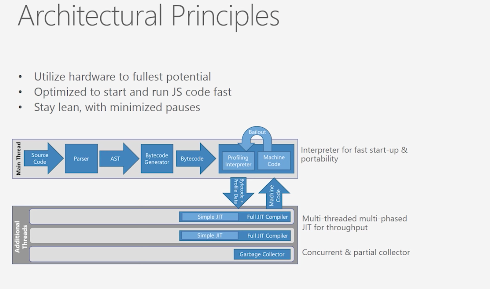
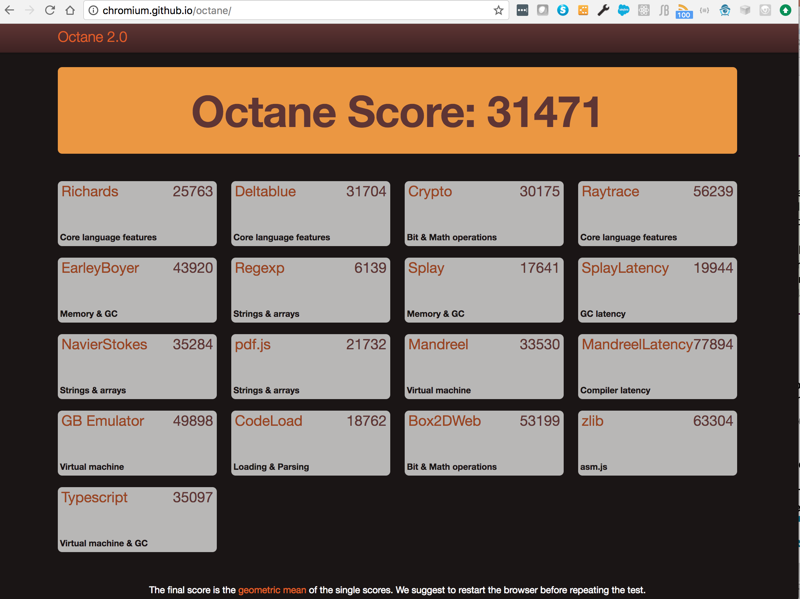
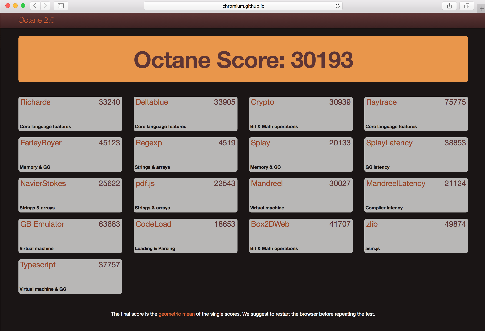
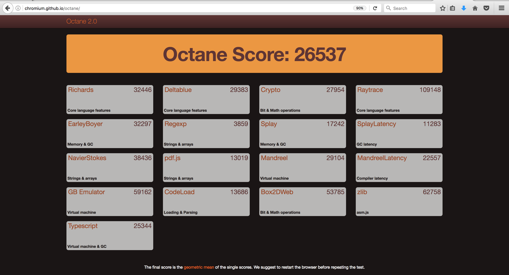

## Notes on IE JavaScript Engine: Chakra and ChakraCore

#### Components

#### Architecture

[Ref](https://github.com/Microsoft/ChakraCore/wiki/Architecture-Overview)

#### Video

### Chakra Core

Chakra Core has certain components of **Chakra** and is modified to report certain data differently.

 Instead of **COM-based** diagnostic APIs, Chakra Core provides **JSON-based diagnostic APIs** which allow more applications with JSON parsers to support Chakra Core.
 
 
 **JS to AST to bytecode**:

Chakra Core first reads through the Javascript code syntax and parses it to generate its AST. 

After the AST is generated, the code is passed to the **bytecode generator** and then the bytecode gets **profiled**. 

This is different from Chrome V8 engine, which has a decision process that decides whether a piece of code should be profiled and optimized or should be turned into bytecode.

During the profiling process, the interpreter attempts to send the code to parallel JIT compilers.

 There are two types of JIT compilers available: 
 
 1. simple JIT compiler (quick compilation without much optimization)
 2. full JIT compiler (takes more time but produces better machine code, in case of code out of it's profile, bailout to simple JIT compiler happens)

**Garbage Collection**

As for garbage collection, it is done in a generational **mark-and-sweep** manner. 

When garbage collection happens, a **foreground and background thread** will be spawned to carry out different executions.

The background garbage collector will do a mark, rescan and mark to find objects that should be cleaned up.

### How to use the Memory tool to diagnose memory issues that can impact the speed and stability of webpages

[Ref](https://docs.microsoft.com/en-us/microsoft-edge/f12-devtools-guide/memory)

#### Use case:

The webpage is performing well when it **first loads**, but gradually slows and sometimes crashes, the page's memory use might be the problem.

How to Diagnosing this memory issue?

After you've loaded your webpage in the browser, open the **F12** developer tools and open the Memory tool (CTRL + 6).

 You can start profiling from this screen and take heap snapshots during the profiling session.
 
If the problem is high memory usage from the start, but not memory growth, take one snapshot and examine it to find the bigger areas of memory use. 

If the memory use grows over time, you can compare snapshots to look at the areas where memory is growing.

Note:

Total memory timeline shows the memory use by the **current browser tab's processes** as a graph over time.

Each snapshot shows a thumbnail of the webpage as it appeared at the **time** the snapshot was taken and specifics about the memory usage of your code.

Object Counts:

The number of new objects created and old objects removed are shown below the object count.

 If these numbers are high, you might have a **performance problem**. When the amount of memory you use isn't bad, but a lot of objects are being created and removed, you create work for the **garbage collector** process which frees up memory. 
 
**Garbase collector and performance impacts:**
 
 Garbage collecting uses (CPU) processing power, however, so it's best to find ways to reuse or recycle these objects and give the garbage collector a break.
 

**Signs for Memory Leak**

Another important factor to keep in mind is the difference between the number of objects being added and objects being removed.

 This is displayed in your second snapshot and beyond in the upper right in a "+x/-y" format.  Example: **+96/-9**
 
In the set of snapshots above, it shows that each time we ran the process we suspected of having a memory issue, we increased the number of objects by **96**, but only removed **9**. 

This is a strong clue that there's a **memory leak** in the process.

Memory leaks will keep expanding the memory use of your webpage during a user's session with it, causing slowness or even instability if the memory use grows too big.

#### Snapshot detailed view

Note:

 If you see: **the DOM node is not attached to the DOM** : this can happen when the node has been removed from the DOM, but is referred to elsewhere.
 
 
 Circular references: 
 
 In its simplest form, a circular reference happens when one object refers to another object that refers back to it, creating a loop.
 

**3 View types**

The three view types

Types:

 view groups objects by their constructor function and gives a count of each type. This makes it easier to know how many arrays you have, how many strings, and so on. Those groups can be expanded to view individual objects.

Roots:

 view shows the major root objects that you can expand to see the child objects associated with them.

Dominators:

 view breaks out all individual HTML elements, DOM nodes, and JavaScript objects your code creates. This is the most detailed of the views.

#### Snapshot comparision view

Here we are comparing Snapshot #3 with Snapshot #2:

## Octane 2.0 rating for the browsers

#### Chrome 60.0.3112.90

#### Safari 10.1.2

#### Firefox 54.0.1

### Comparsion chart

 

 

