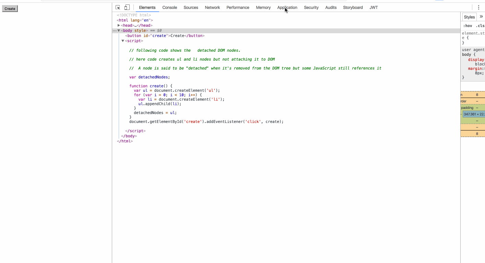

### Google Chrome V8

The V8 engine has an interpreter named **Ignition**. 

This interpreter is used for **interpreting and executing low level bytecode**. Bytecodes, although slower, are smaller than machine codes and requires **lesser** compilation time.


[v8-Ignition-Design-Doc.pdf](./doc/v8-Ignition-Design-Doc.pdf)

[V8-Ignition-online-doc](https://docs.google.com/document/d/11T2CRex9hXxoJwbYqVQ32yIPMh0uouUZLdyrtmMoL44/edit?ts=56f27d9d#heading=h.6jz9dj3bnr8t)


In order to compile Javascript to bytecode, the Javascript code has to be parsed to generate its **Abstract Syntax Tree** (AST). 

The interpreter has an accumulator register, which allows it reduce the size of the bytecode. The overall design makes Ignition a highly efficient interpreter.


Optimizing JIT compiler - **TurboFan** is better than CranShaft JIT:

TurboFan combines a cutting-edge intermediate representation with a multi-layered translation and optimization pipeline to **generate better quality machine code** than what was previously possible with the **CrankShaft JIT**. 

Optimizations in TurboFan are more numerous, more sophisticated, and more thoroughly applied than in CrankShaft, enabling fluid code motion, control flow optimizations, and precise numerical range analysis, all of which were more previously unattainable.

TurboFan is developed  with a layered architecture to allow the compiler to cope with new demands (due to new features) over time. 

A clearer separation between the source-level language (JavaScript), the VM's capabilities (V8), and the architecture's intricacies (from x86 to ARM to MIPS - around 7 target architectures) allows for cleaner and more robust code.

 Layering allows those working on the compiler to reason locally when implementing optimizations and features, as well as write more effective unit tests.


Each of the 7 target architectures supported by TurboFan requires fewer than 3,000 lines of platform-specific code, versus 13,000-16,000 in CrankShaft. 

This enabled engineers at ARM, Intel, MIPS, and IBM to contribute to TurboFan in a much more effective way.

 TurboFan is able to more easily support all of the coming features of ES6 because its flexible design separates the JavaScript frontend from the architecture-dependent backends.
 
 JavaScript enters the compiler pipeline in a mostly unoptimized form and is translated and optimized to progressively lower forms until machine code is generated. 
 
 The centerpiece of the design is a more relaxed sea-of-nodes internal representation (IR) of the code which allows more effective reordering and optimization.
 
 
 
 
 The graph-based IR allows most optimizations to be expressed as simple **local** reductions which are easier to write and test independently. 
 
 An optimization engine applies these local rules in a systematic and thorough way. 
 
 Transitioning out of the graphical representation involves an innovative scheduling algorithm that makes use of the reordering freedom to move code out of loops and into less frequently executed paths. 
 
 Finally, architecture-specific optimizations like complex instruction selection exploit features of each **target** platform for the best quality code.
 


[Digging into TurboFan](https://v8project.blogspot.de/2015/07/digging-into-turbofan-jit.html)

[Ref](https://developers.redhat.com/blog/2016/05/31/javascript-engine-performance-comparison-v8-charkra-chakra-core-2/)


**JS to AST to bytecode**:


TurboFan will profile the code and see if it is used **multiple times** throughout the entire Javascript execution. If it is, the code will be **dynamically optimized** immediately into machine code, without any intermediate binary code. 

If it is a one-time executed “non-hot” code, it will only be compiled into binary code.


### Garbage Collection:


Garbage collection is also done in a **stop-the-world**, generational way. This means that before the JavaScript engine does garbage collection, all processing of JavaScript **will be paused** and the garbage collector will find objects and data that are **no longer referenced** and collect them. This ensures that garbage collection is done in an accurate and efficient way

Latest version of chrome uses incremental garbage collector [Ref](https://blog.chromium.org/2011/11/game-changer-for-interactive.html)
This dramatically improves interactive performance of web apps and HTML5 games. Avoiding pauses is vital to achieving good interactive performance. Previously, garbage collection pause times depended on the amount of memory used. Therefore, large interactive apps were impacted by pauses that caused hiccuping. V8’s new GC reduces pause times dramatically while maintaining great peak performance and memory use.


**Inspiration for the Chrome Design: Modern Operating Systems (Unix/Linux!)**:

[Ref](https://www.chromium.org/developers/design-documents/multi-process-architecture)

Modern operating systems are more robust because they put applications into separate processes that are walled off from one another.

A crash in one application generally does not impair other applications or the integrity of the operating system, and each user's access to other users' data is restricted.

In Chrome, we use **separate processes** for **browser tabs** to protect the overall application from bugs and glitches in the rendering engine. 

We also restrict access from each rendering engine process to others and to the rest of the system. In some ways, this brings to web browsing the benefits that memory protection and access control brought to **operating systems**.

We refer to the main process that runs the UI and manages tab and plugin processes as the **browser process** or **browser.** 

Likewise, the tab-specific processes are called **render processes** or **renderers**


The renderers use the Blink open-source layout engine for interpreting and laying out HTML.

The browser and the renderers communicate using Chromium's IPC system.
[Ref](https://www.chromium.org/developers/design-documents/inter-process-communication)

Chromium has a multi-process architecture which means that we have a lot of processes communicating with each other. 

Our main inter-process communication primitive is the **named pipe**. On Linux & OS X, we use a ```socketpair()``.

A **named pipe** is allocated for each **renderer process** for communication with the **browser process**. 

These pipes are used in asynchronous mode to ensure that neither end is blocked waiting for the other.

### Browser side

Within the browser, communication with the renderers is done in a separate I/O thread. Messages to and from the views then have to be proxied over to the main thread using a ChannelProxy (Channel as shown the above diagram).

 The advantage of this scheme is that resource requests (for web pages, etc.), which are the most common and performance critical messages, can be handled entirely on the I/O thread and not block the user interface. 
 
 These are done through the use of a 
 
 ```c++
 ChannelProxy::MessageFilter
 ```
 
  which is inserted into the channel by the RenderProcessHost. This filter runs in the I/O thread, intercepts resource request messages, and forwards them directly to the resource dispatcher host. 


### Renderer side

Each renderer also has a thread that manages communication (in this case, the main thread), with the rendering and most processing happening on another thread (renderer thread)


We have two primary types of messages: **routed** and **control**.

Control Messages:

Control messages are handled by the class that created the pipe. Sometimes that class will allow others to received message by having a MessageRouter object that other listeners can register with and received "routed" messages sent with their unique (per pipe) id.


Routed Messages:

Routed Messages have historically been used to get messages to a specific **RenderViewHost**. However, technically any class can receive routed messages by using 

```c++
RenderProcessHost::GetNextRoutingID
```

 and registering itself with ```RenderProcessHost::AddRoute```.
 
  Currently, both RenderViewHost and RenderFrameHost instances have their own routing IDs.
  
  
Messages related to a document's frame sent from the **browser to the renderer** are called **Frame messages** because they are being sent to the RenderFrame.


Messages sent from the **renderer to the browser** are called **FrameHost messages** because they are being sent to the RenderFrameHost


[Ref](https://github.com/ChromiumWebApps/chromium/blob/master/content/common/frame_messages.h)

```c++

//----------------------------------------------------------------------------
// Messages sent from the renderer to the browser.

// Sent by the renderer when a child frame is created in the renderer.
//
// Each of these messages will have a corresponding FrameHostMsg_Detach message
// sent when the frame is detached from the DOM. 
// -- FrameHost messages
IPC_SYNC_MESSAGE_CONTROL2_1(FrameHostMsg_CreateChildFrame,
                            int32 /* parent_routing_id */,
                            std::string /* frame_name */,
                            int32 /* new_routing_id */)
                            
//...


// -----------------------------------------------------------------------------
// Messages sent from the browser to the renderer.

// When HW accelerated buffers are swapped in an out-of-process child frame
// renderer, the message is forwarded to the embedding frame to notify it of
// a new texture available for compositing. When the buffer has finished
// presenting, a FrameHostMsg_BuffersSwappedACK should be sent back to
// gpu host that produced this buffer.
//
// This is used in the non-ubercomp HW accelerated compositing path.
// Frame messages
IPC_MESSAGE_ROUTED1(FrameMsg_BuffersSwapped,
                    FrameMsg_BuffersSwapped_Params /* params */)
                                             
                            
```

PluginProcess messages is for sending messages from the browser to the plugin process.

```
//-----------------------------------------------------------------------------
// PluginProcess messages
// These are messages sent from the browser to the plugin process.
// Tells the plugin process to create a new channel for communication with a
// given renderer.  The channel name is returned in a
// PluginProcessHostMsg_ChannelCreated message.  The renderer ID is passed so
// that the plugin process reuses an existing channel to that process if it
// exists. This ID is a unique opaque identifier generated by the browser
// process.
IPC_MESSAGE_CONTROL2(PluginProcessMsg_CreateChannel,
                     int /* renderer_id */,
                     bool /* off_the_record */)
                     
```

                     
PluginProcessHost messages  is for sending messages from the plugin process to the browser). 

```c++
//-----------------------------------------------------------------------------
// PluginProcessHost messages
// These are messages sent from the plugin process to the browser process.
// Response to a PluginProcessMsg_CreateChannel message.
IPC_MESSAGE_CONTROL1(PluginProcessHostMsg_ChannelCreated,
                     IPC::ChannelHandle /* channel_handle */)
```
 
 
Pickling values

Parameters are serialized and de-serialized to message bodies using the ParamTraits template.
 


Handling messages:

Messages are handled by implementing the IPC::Listener interface, the most important function on which is OnMessageReceived. We have a variety of macros to simplify message handling in this function, which can best be illustrated by example:


```c++

MyClass::OnMessageReceived(const IPC::Message& message) {
  IPC_BEGIN_MESSAGE_MAP(MyClass, message)
    // Will call OnMyMessage with the message. The parameters of the message will be unpacked for you.
    IPC_MESSAGE_HANDLER(ViewHostMsg_MyMessage, OnMyMessage)  
    ...
    IPC_MESSAGE_UNHANDLED_ERROR()  // This will throw an exception for unhandled messages.
  IPC_END_MESSAGE_MAP()
}

// This function will be called with the parameters extracted from the ViewHostMsg_MyMessage message.
MyClass::OnMyMessage(const GURL& url, int something) {
  ...
}
```

Channels:

IPC::Channel (defined in ipc/ipc_channel.h) defines the methods for communicating across pipes. Channels are not thread safe. When the UI thread wants to send a message, it must go through the I/O thread. For this, we use a IPC::ChannelProxy. It has a similar API as the regular channel object, but proxies messages to **another thread** for sending them, and proxies messages back to the original thread when receiving them. It allows your object (typically on the UI thread) to install a IPC::ChannelProxy::Listener on the channel thread (typically the I/O thread) to filter out some messages from getting proxied over. We use this for resource requests and other requests that can be handled directly on the I/O thread. RenderProcessHost installs a RenderMessageFilter object that does this filtering.


Synchronous messages -  we must do in the browser.  Example: spell-check

Synchronous browser-to-renderer IPC is disallowed to prevent blocking the user-interface on a potentially flaky renderer.

**Do not ** handle any synchronous messages in the UI thread! You must handle them only in the I/O thread. Otherwise, the application might deadlock because plug-ins require synchronous painting from the UI thread, and these will be blocked when the renderer is waiting for synchronous messages from the browser.

```c++
IPC_SYNC_MESSAGE_CONTROL2_1(SomeMessage,  // Message name
                            GURL, //input_param1
                            int, //input_param2
                            std::string); //result
```

```c++

const GURL input_param("http://www.google.com/");
std::string result;
content::RenderThread::Get()->Send(new MyMessage(input_param, &result));
printf("The result is %s\n", result.c_str());

```


Handling Sync messages:


```
IPC_MESSAGE_HANDLER(MyMessage, OnMyMessage)
// to the OnMessageReceived function, and write:
void RenderProcessHost::OnMyMessage(GURL input_param, std::string* result) {
  *result = input_param.spec() + " is not available";
}
```


About Blink:

[Ref](https://www.chromium.org/blink)

Blink is a rendering engine used in Chrome (from version 28 onwards). Blink is a fork of the WebCore component of WebKit.


#### How to fix memory problems in Chrome?
[Ref](https://developers.google.com/web/tools/chrome-devtools/memory-problems/)


